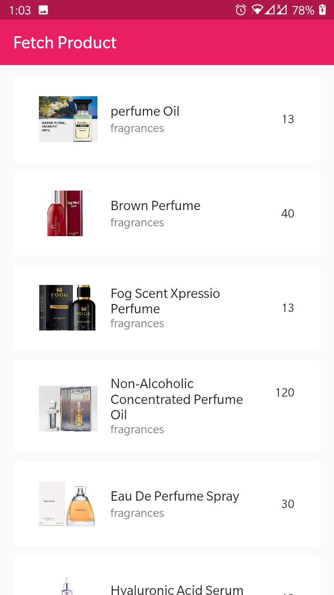
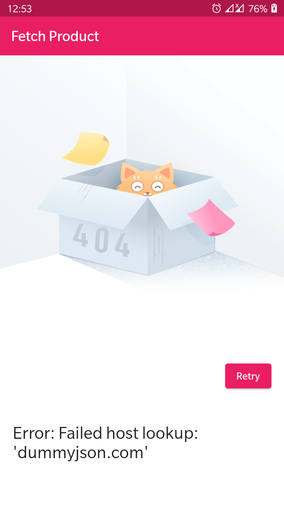
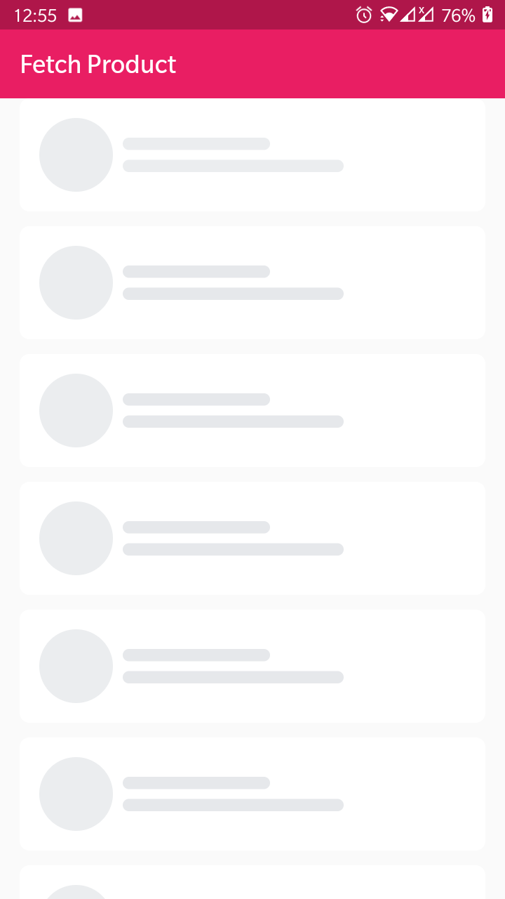

# Flutter Bloc State Management

The Bloc API is a state management library for building Flutter applications. It helps you manage the state of your application by providing a way to organize your code into discrete units called "Blocs". A Bloc is a component that manages a specific piece of application state and provides methods for interacting with that state.

To get started with using the Bloc API, you'll need to do the following:

## Screenshots

## Features

- Using Equatable
- RestFull API 
- Error Handling

## Getting Started

1. Clone this repository
2. Open the project in your preferred IDE (e.g. Android Studio, Visual Studio Code)
3. Install the necessary dependencies by running `flutter pub get`
4. Run the app on an emulator or physical device by running `flutter run`

## Dependencies

- [http](https://pub.dev/packages/http) for api repository calling.
- [bloc](https://pub.dev/packages/flutter_bloc) for state management.
- [equatable](https://pub.dev/packages/equatable)  to implement value based equality without needing to explicitly override == and hashCode.
- [animated_shimmer](https://pub.dev/packages/animated_shimmer)  for shimmer effect.

## 🔗 Follow

